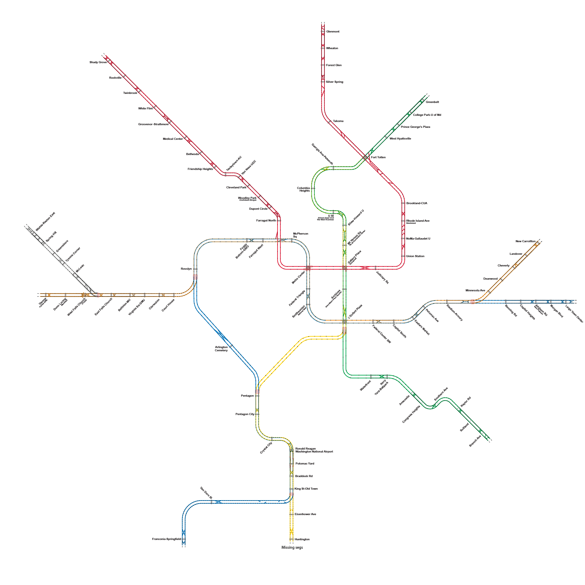
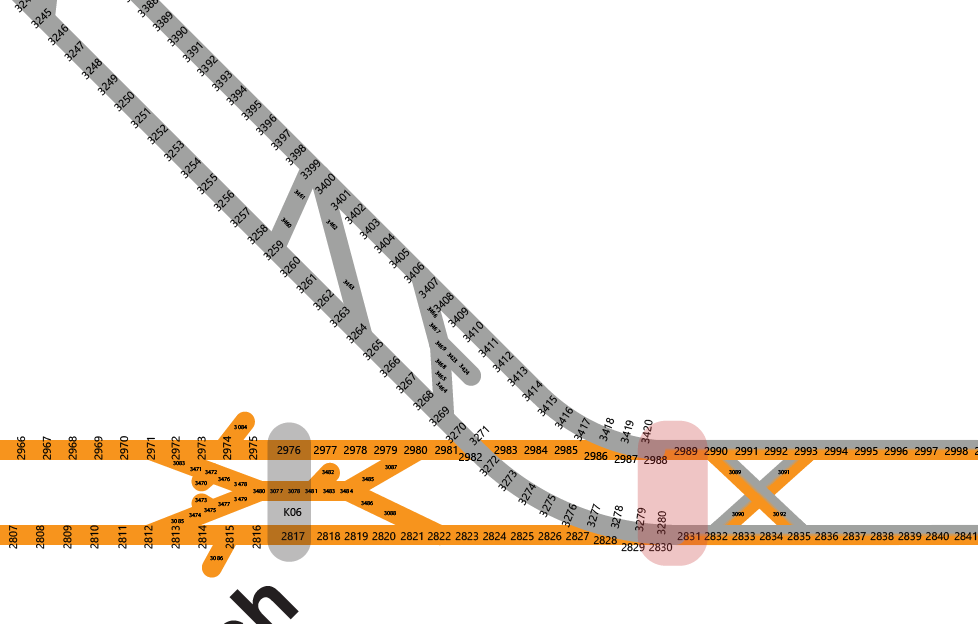
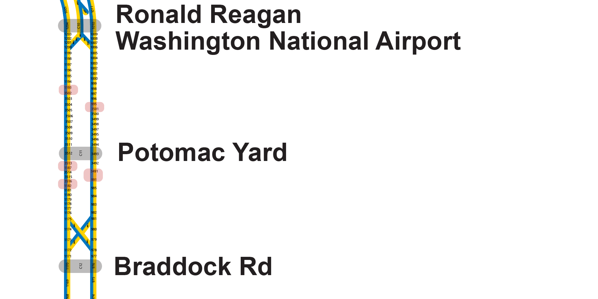

# WMATA Segment Map
(but first, an image)


## About DC Metro Rail
[DC Metro Rail](https://en.wikipedia.org/wiki/Washington_Metro) is composed of:
- 70 miles of track
- 91 stations
- 6 lines
- 626,000 daily average riders
- 1,290 active rail cars (mated into 645 trainsets from which they can build 4, 6 and 8 car trains)

The rail system itself is divided into 3,325 globally unique (although potentially non sequential) `CircuitIDs`. Each track is non-uniquely named 1, 2 or 3 (each line has a track 1 and 2 etc...)

This graphic from the [WMATA developer](https://developer.wmata.com/) page shows a fictional setup. The diagram shows a single sided crossover track, with one center rail:


When querying the [WMATA API](https://developer.wmata.com/) for a list of all track segments `https://api.wmata.com/TrainPositions/TrackCircuits?contentType={contentType}` for the curious it returns a JSON that looks like this:
```
{
"TrackCircuits": [{
"Track": 2,
"CircuitId": 8,
"Neighbors": [{
"NeighborType": "Right",
"CircuitIds": [4, 3]
}]
}, {
"Track": 2,
"CircuitId": 4,
"Neighbors": [{
"NeighborType": "Left",
"CircuitIds": [8]
}, {
"NeighborType": "Right",
"CircuitIds": [9]
}]
}, {
"Track": 2,
"CircuitId": 9,
"Neighbors": [{
"NeighborType": "Left",
"CircuitIds": [4]
}]
}
```
and so on....

Stations are essentially a super-notation onto speecific track segments:
- For instance: `Van Ness-UDC` station is station code `A06`. Circuits `142` and `346` are flagged with this stations code.

## Mapping This Madness
As far as I know, I'm the first person to publish a graphical map of the `CircuitID` information. It is available in this repo. Please see the [Copying.md](Copying.md)) file for license information. 

WMATA has published a much simplified (and not complete) version in their [2012 Strategic Plan](https://www.wmata.com/initiatives/strategic-plans/upload/7Metro-2025-Pocket-Tracks-Secure.pdf):


## The Map
(Available in the original AI, PDF and SVG in this repo)
Also, searchable as a PDF or SVG. Useful if you're looking for a specific circuit!


## Making the Map
I wrote several [Grasshopper](https://www.grasshopper3d.com/) scripts to help me make sense of the data. Some interesting sections:
- Areas where track shifts numbering:


- Areas where tracks diverge:


- Pocket tracks:


- Very dense numbering on the newer (and more geographically spread out areas of the map)


- Infill stations:
  - WMATA inserted new track segments and changed the standard route for the `Potomac Yards` infill station, added in 2023. 


I did most of the numbering in Grasshopper, relying on my script to spit out sequential circuit IDs and distribute the text. I hand-plotted all the pocket tracks and sidings. 

Please note: While the original DC Metro map is copyright WMATA (various years), I made this map and everything in it. I've licensed it under the GNU GPL V3 license. You can read more in the [copying](Copying.md) section. Thank you.


