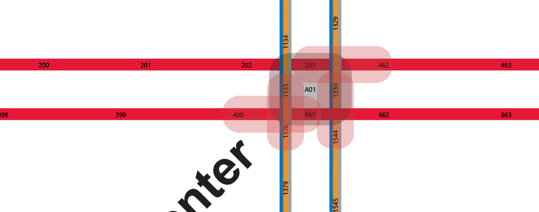
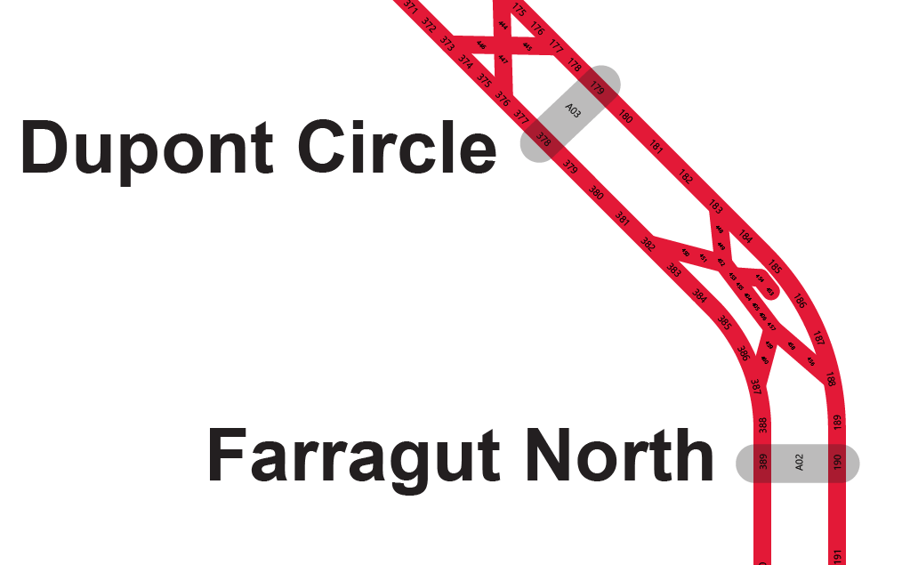

# WMATA Segment Map
(but first, an image)

## About DC Metro Rail
[DC Metro Rail](https://en.wikipedia.org/wiki/Washington_Metro) is composed of:
- 70 miles of track
- 91 stations
- 6 lines
- 626,000 daily average riders
- 1,290 active rail cars (mated into 645 trainsets from which they can build 4, 6 and 8 car trains)

The rail system itself is divided into 3,325 globally unique (although potentially non sequential) `CircuitIDs`. Each track is non-uniquely named 1, 2 or 3 (each line has a track 1 and 2 etc...)

This graphic from the [WMATA developer](https://developer.wmata.com/) page shows a fictional setup. The diagram shows a single sided crossover track, with one center rail:

## Mapping This Madness
As far as I know, I'm the first person to publish a graphical map of the `CircuitID` information. It is available in this repo. Please see the [Copying.md](copying.md) file for license information. 

WMATA has published a much simplified (and not complete) version in their [2012 Strategic Plan](https://www.wmata.com/initiatives/strategic-plans/upload/7Metro-2025-Pocket-Tracks-Secure.pdf):

## The Map
(Available in the original AI, PDF and SVG in this repo)

## Making the Map
I wrote several [Grasshopper](https://www.grasshopper3d.com/) scripts to help me make sense of the data. Some interesting sections:
- Areas where track shifts numbering:

- Areas where tracks diverge:

- Pocket tracks:

- Very dense numbering on the newer (and more geographically spread out areas of the map)

